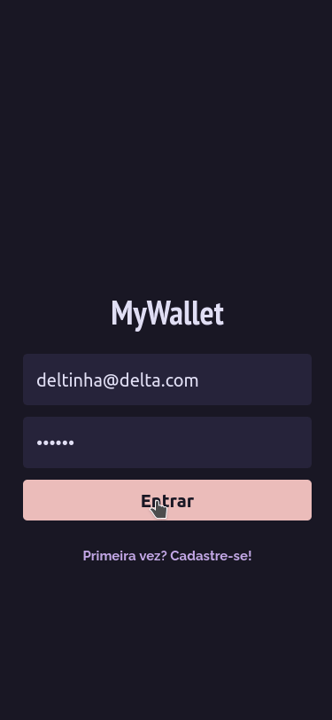

# MyWallet



## About

MyWallet simplifies the management of your personal finances. It helps you track your financial transactions and review your all time financial data, so you can understand your incoming and spending.

Try it out now at [http://mywallet-front-zeta.vercel.app/](http://mywallet-front-zeta.vercel.app/)

Features include:

- Register
- Login
- List your transactions
- Add incoming
- Add spending

## Technologies

- React
- React Router Dom
- Axios
- styled-components
- styled-react-modal
- dayjs

## Running locally

1. Clone this repo

```sh
git clone https://github.com/Deltinha/mywallet-front.git
```

2. Install NPM packages

```sh
npm install
```

3. Run the app in development mode

```sh
npm start
```

Open [http://localhost:3000](http://localhost:3000) to view it in the browser. 

### You also need to run the back-end repo.  See [https://github.com/Deltinha/mywallet-back](https://github.com/Deltinha/mywallet-back) for details.